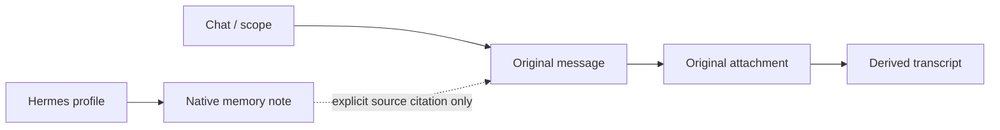

# Dashboard, configuration, CLI and memory explorer

Status: accepted for phased implementation, 2026-09-07 (ADR-0025).
See `TASK.md` for delivered increments. Existing production release gates remain.

## Direction

Use the Hermes web dashboard as the owner-facing shell, with a Nocheh extension
for archive imports, policy, operations and memory inspection. Reuse the official
Honcho CLI for supported data operations through an isolated Nocheh wrapper.
Keep all existing shell commands working.

Current upstream documentation supports dashboard UI tabs and Python backend
plugins. Verify those interfaces against the pinned Hermes revision
`7166071fcaadb36df26f6d753dda97da6b5d699e` before implementation. The Compose image
currently installs messaging dependencies and starts Nocheh's supervisor; the
dashboard is not yet packaged, exposed or validated. Current upstream docs are
capability evidence, not proof of compatibility with that image.

## What already exists

| Area | Implemented interface | Gap |
| --- | --- | --- |
| Configuration | `scripts/configuration.py`, ignored root `.env` | No settings forms, effective-setting view or controlled apply operation |
| Runtime operations | `scripts/nocheh` | No dashboard; `config` currently only validates Compose |
| History import | `scripts/archive.py`, authenticated archive API | No file picker, preview or durable import-job interface |
| Native memory | Hermes profile memory files and session SQLite | No owner memory-content browser |
| Archive inspection | Authenticated search/read API and read-only pgweb | No combined source and memory explorer |
| Honcho | Separate experiment lifecycle and benchmark runner | No general data-inspection CLI; live evaluation pending |

Code finding: `prepare_profile()` in `integrations/hermes/assistant_gateway.py`
rewrites profile `config.yaml` before each turn. `assistant_turn.py` also supplies
model, tools, reasoning and turn limits directly to `AIAgent`. Exposing a YAML
editor alone would therefore create settings that are overwritten or ignored.

## Configuration ownership

Keep ADR-0024's single editable `.env` for Nocheh settings. The dashboard is an
editor of existing authoritative stores, not a new settings database.

| Store | Owns | Management behavior |
| --- | --- | --- |
| Nocheh `.env` | Compose settings, Telegram allowlist, guard policy, shared model selection, internal secrets | Validated owner forms; preserve unknown existing entries; private atomic writes |
| Hermes profile `config.yaml` | Supported native preferences that Nocheh does not own | Native schema and editor; preserve across turns |
| Hermes native `auth.json` | Subscription login and token rotation | Show login health; Hermes remains the sole refresh owner |
| Isolated Honcho experiment state | Experiment endpoint, separate credentials, meter and server configuration | Separate section, never inherit production credentials |

Define one resolver shared by startup, dashboard and CLI. Nocheh-owned fields
override their generated Hermes counterparts; unsupported fields are explicitly
reported. Keep subscription routing, scoped tool access and mandatory guard
enforcement outside an unrestricted generic config editor. Ordinary native
preferences retain their native schema. Map every exposed field to its actual
runtime consumer and a test before making it editable.

Every setting displays its effective value, source, and whether applying it needs
a new turn or a service restart. Secret responses return only configured/missing
status; replacement values are write-only. Save validates and shows a redacted
diff. Apply runs an allowlisted operation, drains affected work where necessary,
then checks health. Concurrent edits use revision checks; a failed apply leaves
the previous working configuration recoverable.

## Dashboard pages

| Page | Owner tasks |
| --- | --- |
| Overview | Inspect service health, authentication, archive backlog, failed downloads/transcripts and delivery state |
| Settings | Edit Nocheh policy and supported Hermes settings; inspect effective values; save/apply changes |
| Imports | Select Telegram Desktop JSON plus media folder, or a ZIP; preview chats, scope and missing media; run and inspect jobs |
| Archive | Search originals, revisions, files and derived transcripts; follow source references; export |
| Memory | Select owner/group profile; inspect `MEMORY.md`, `USER.md` and native sessions; inspect Honcho separately when configured |
| Graph | Explore scoped source relationships and available memory citations; open underlying evidence |
| Operations | Diagnose, backup, inspect jobs and request explicit restore/restart operations |

The Nocheh supervisor owns Telegram dispatch. Native gateway-start, embedded
chat, provider changes and unrestricted tool controls must not accidentally start
a second bot or bypass the Nocheh request boundary. Verify enforcement on backend
routes; hiding a UI control is insufficient. Local owner authentication applies
to plugin routes too. Test the pinned dashboard's auth behavior directly because
upstream documentation differs between extension examples. Do not publish the
archive service bearer token to the browser or mount a Docker socket in the UI.

Use a TypeScript management service for Nocheh jobs/policy/API operations and a
thin Python bridge for native Hermes APIs. A small local operation runner can
execute enumerated Compose actions without accepting arbitrary shell text.
The dashboard and CLI call the same operations and receive the same job IDs.

## Manual import flow

1. Select the export, with supplied media. JSON alone remains usable, with missing
   media clearly reported. Support both single-chat and `chats.list` exports.
2. Preview chat names, message counts, dates and supplied/missing files locally.
3. Choose the archive scope. Default to owner-only Desktop scope. Sharing imported
   history with an existing group requires explicit owner mapping; never guess
   Bot API IDs from export IDs.
4. Start a durable job and display progress, duplicate/revision counts and errors.
5. Resume after interruption using the existing stable event identities. Cancel
   stops future work and retains originals already committed.

Reuse the importer rather than implement a browser-specific parser. Extract its
current command loop into a callable job operation. Bound upload and unpack sizes,
reject escaping paths/symlinks, and preserve the selected original export bytes
with import provenance. Existing message payloads and media remain unchanged.
Historical import must send zero Telegram replies. Importing into the archive
does not itself populate Hermes notes or Honcho; later memory processing must be
an explicit, separately observable job following guard and scope policy.

## CLI

Proposed command surface, not commands available today:

```text
./scripts/nocheh dashboard
./scripts/nocheh config show
./scripts/nocheh config set KEY VALUE
./scripts/nocheh config apply
./scripts/nocheh import telegram /export/result.json
./scripts/nocheh jobs list
./scripts/nocheh jobs show JOB_ID
./scripts/nocheh memory list
./scripts/nocheh memory show --scope CHAT_ID
./scripts/nocheh memory graph --scope CHAT_ID --output graph.json
./scripts/nocheh honcho doctor
./scripts/nocheh honcho workspace list
./scripts/nocheh honcho peer inspect PEER_ID
./scripts/nocheh honcho session view SESSION_ID
```

Keep existing `scripts/archive.py` and `scripts/honcho-experiment` interfaces.
Provide structured JSON output, pagination and meaningful exit codes. Secret
changes use a hidden prompt or stdin, never command-line values.

Pin and test the official `honcho-cli` against the experiment's pinned server.
Use it for peers, sessions, messages, representations and conclusions where the
server supports them. The wrapper selects only the explicit experiment endpoint
and credentials, with no fallback to a global Honcho account. Existing experiment
Compose remains the lifecycle owner; do not invoke the upstream default stack
wizard and create an unmetered second deployment. Exports retain pagination and
completion metadata. Reading stored data is distinct from asking Honcho to reason:
classify endpoints by actual provider calls, including embedding-backed search.
All experiment inference still passes through its meter and $5 ceiling.

## Memory and graph semantics

Hermes notes and user profile are mutable native memory, and session history is
native SQLite state. Read them through the selected profile with bounded access;
do not expose arbitrary filesystem paths. Empty memory is a valid state. Start
with read-only inspection; later edits should use native validation plus revision
checks and a recorded before/after revision rather than racing agent writes.

Honcho memory remains a separate experimental view: workspace, peer, sessions,
messages, stored conclusions and representations. Display unavailable or pending
status honestly. Neither inspecting Honcho nor enabling a dashboard changes the
accepted production memory architecture.

The first graph is a deterministic view over existing data:



Include authorship and reply relationships where the original payload supplies
them. Notes without source references show provenance unavailable; do not invent
supporting messages. Semantic entities and inferred relations are an optional
later derived projection, with model/version/time and evidence links. Label
inferences separately from observed links. Bound graph queries and expand on
selection rather than sending the entire archive to the browser. Apply scope to
both nodes and edges on the server. No additional graph database is required for
the initial view. Repository Graphify remains development tooling only.

## Implementation sequence and acceptance

1. **Compatibility and config:** verify pinned dashboard packaging/plugin/auth;
   define the settings resolver; preserve native preferences across turns; prove
   exposed settings take effect and unsupported settings cannot weaken policy.
2. **Owner dashboard and import jobs:** package one local dashboard, owner session,
   status/settings, file upload and durable imports. Test unauthorized requests,
   malicious uploads, scope mapping, repeated imports, restart/resume and zero
   historical replies. Verify both UI and old CLI against Compose.
3. **Memory and Honcho CLI:** profile memory/session browser and isolated upstream
   CLI wrapper. Test wrong-profile denial, credential isolation, pagination,
   unavailable Honcho and structured errors. Live Honcho checks stay pending until
   the experiment's separate credentials exist.
4. **Graph and operations:** scoped deterministic graph with source detail and
   export, then safe lifecycle/backup controls. Verify all graph links against
   originals and recheck existing guard, archive and assistant acceptance paths.

Commit each verified increment and record its actual evidence. Dashboard work
does not make the outstanding production Telegram release gates pass.

## References

- [Hermes dashboard](https://hermes-agent.nousresearch.com/docs/user-guide/features/web-dashboard)
- [Dashboard extension API](https://hermes-agent.nousresearch.com/docs/user-guide/features/extending-the-dashboard)
- [Hermes native configuration](https://hermes-agent.nousresearch.com/docs/user-guide/configuration/)
- [Hermes native memory](https://hermes-agent.nousresearch.com/docs/user-guide/features/memory/)
- [Official Honcho CLI](https://github.com/plastic-labs/honcho/tree/main/honcho-cli)
- [Current import contract](import-export.md)
- [Current configuration decision](adr/0024-single-environment-configuration.md)
- [Current Honcho experiment](../experiments/honcho/README.md)
