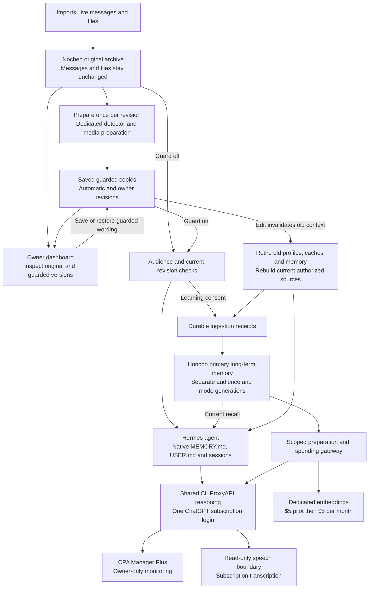

# Guarded copies and primary memory

Implementation: ADR-0033. Actual activation and acceptance are recorded in TASK.md;
Honcho stays detached until real provider checks pass.



The shared route stays inactive until `./scripts/nocheh provider cutover` passes
the live checks recorded in `TASK.md`. The native Hermes route remains the rollback
during that gate. Honcho memory attachment still requires its separate embedding
and recall acceptance.

1. Import `Database password: mango123`. The original is archived unchanged.
2. Preparation saves `Database password: ***`. You can inspect both versions.
3. Save `Database credentials are in my password manager.` in the guarded editor.
4. With guarding **on**, current archive retrieval and permitted memory learning
   use that exact wording. Existing contexts retire; only current generations can
   be used. With guarding **off**, agents use originals with the same audience rules.

Normal reuse reads the saved copy without detecting the stored text again. A new
question, new tool result or new generated summary can require its own preparation.
Automatic preparation never replaces an original or an owner-edited projection.

## Operating the local system

- Apply configuration with `./scripts/nocheh up`. `auto` migrates to `on`.
- Dashboard → Archive → Browse → open a source to inspect/edit guarded copies,
  original file access, preparation status and revision history.
- Dashboard → Honcho shows attachment, generations, receipts and live-gate status.
- `./scripts/nocheh memory honcho status` provides the same connection state.
- `./scripts/nocheh memory honcho attach --catch-up` includes consented sources
  received while detached. `--include-history` includes older consented sources.
- `./scripts/nocheh memory honcho detach` stops memory use without deleting data.
- `./scripts/nocheh backup` preserves originals, guarded histories, native state,
  consent, receipts and a spending-ledger snapshot. Restores start inactive and
  detached on a separate memory network. Never replace a newer spending ledger
  with an older snapshot. Rebuild Honcho from the archive after reconciliation.
- `python3 -m scripts.archive import DIRECTORY --restore-guarded` explicitly
  restores trusted guarded history from your own export. Ordinary imports prepare
  copies again and do not accept supplied guarded text as already trusted.

Configure embeddings in the root `.env`:

```dotenv
NOCHEH_EMBEDDING_PROVIDER='openai'
NOCHEH_EMBEDDING_MODEL='text-embedding-3-small'
OPENAI_API_KEY='' # Set your dedicated key locally; never commit it.
```

OpenAI is the only enabled provider. `text-embedding-3-large` is also supported
for a fresh setup; both models use 1536 dimensions. After the first paid attempt,
switching embedding models is blocked until memory is rebuilt, so incompatible
vectors cannot mix. The small model reserves $0.01 per bounded request; the large
model reserves $0.02. The total spending caps stay unchanged (ADR-0034).
`NOCHEH_MODEL` is the separate Hermes subscription reasoning model.
The old `NOCHEH_EMBEDDING_API_KEY` is a migration alias; explicit `OPENAI_API_KEY`
wins, including an empty value. Only the isolated meter receives the paid key.
Settings displays credential presence, never its value. Edit these fields in `.env`
and restart the Honcho stack (`up` while isolated, `runtime-up` when attached).

`./scripts/nocheh provider login` starts the one shared CLIProxyAPI device login.
The isolated stack uses pinned revisions and cannot bypass the spending gateway.
After saving the dedicated embedding key and completing the shared login, run these in
order, keeping failures pending:

```sh
./scripts/honcho-experiment verify-memory
./scripts/honcho-experiment accept-memory
./scripts/honcho-experiment runtime-init
./scripts/nocheh up
./scripts/honcho-experiment runtime-up
./scripts/nocheh memory honcho attach
```

`verify-memory` uses synthetic content and records actual ingestion, retrieval,
reasoning, embedding canary, restart and provider-failure results. `accept-memory`
rejects incomplete reports. `runtime-init` installs the private gateway credential;
the runtime overlay binds model attempts to current Nocheh audiences. A scoped
Nocheh ingestion/recall and opted-in history pilot still needs verification after
attachment. These commands do not grant import-learning consent.

The total pilot cap stays at $5. After the pilot, `./scripts/honcho-experiment monthly`
enables the agreed $5 per UTC calendar month cap; it requires accepted, attached
memory and preserves all pilot reservations. Repeating it cannot reset spending.

During outages or rebuilding, current context, native notes and archive search
remain available with limited-memory status. Old provider data cannot be recalled
by editing a local copy. Guarding is preparation, not encryption or a guarantee
that the detector found every secret.
