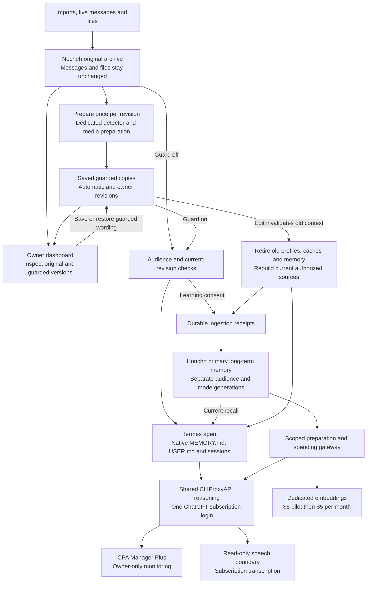

# Guarded copies and primary memory

The accepted target below is defined in [SPECS.md](../SPECS.md), with rationale in
ADR-0033 and ADR-0035. Actual activation and acceptance are recorded in
[TASK.md](../TASK.md); the diagram describes system design, not the current
connection state.



A fresh installation must pass the shared-provider cutover and Honcho's separate
embedding and recall acceptance before attachment. [TASK.md](../TASK.md) records
the active installation's completed checks and remaining pilot work.

1. Import `Database password: mango123`. The original is archived unchanged.
2. Preparation saves `Database password: ***`. You can inspect both versions.
3. Save `Database credentials are in my password manager.` in the guarded editor.
4. With guarding **on**, current archive retrieval and permitted memory learning
   use that exact wording. Existing contexts retire; only current generations can
   be used. With guarding **off**, agents use originals with the same audience rules.

Normal reuse reads the saved copy without detecting the stored text again. A new
question, new tool result or new generated summary can require its own preparation.
Automatic preparation never replaces an original or an owner-edited projection.

<speech_path>

Hermes uses its native STT provider interface with Nocheh's
`nocheh-subscription` adapter. The adapter sends audio to the local speech service,
which runs pinned `codex-asr` through the shared ChatGPT login. This supplies the
subscription speech route and keeps OAuth access outside the agent; the pinned
CPA proxy supplies text reasoning and does not expose this speech route.

The separate speech service is not required by guarding itself. The transcript is
stored as derived source text and prepared for guarded downstream use. Audio must
reach the trusted transcription endpoint before there is text to guard. This
does not require another login or a paid transcription key.

</speech_path>

## Operating the local system

- Apply configuration with `./scripts/nocheh up`. `auto` migrates to `on`.
- Dashboard → Archive → Browse → open a source to inspect/edit guarded copies,
  original file access, preparation status and revision history.
- Dashboard → Honcho shows attachment, generations, receipts and live-gate status.
- `./scripts/nocheh memory honcho status` provides the same connection state.
- `./scripts/nocheh memory honcho attach --catch-up` includes consented sources
  received while detached. `--include-history` includes older consented sources.
- `./scripts/nocheh memory honcho detach` stops memory use without deleting data.
- `./scripts/nocheh backup` preserves originals, guarded histories, native state,
  consent, receipts and a spending-ledger snapshot. Restores start inactive and
  detached on a separate memory network. Never replace a newer spending ledger
  with an older snapshot. Rebuild Honcho from the archive after reconciliation.
- `python3 -m scripts.archive import DIRECTORY --restore-guarded` explicitly
  restores trusted guarded history from your own export. Ordinary imports prepare
  copies again and do not accept supplied guarded text as already trusted.

Configure embeddings in the root `.env`. Use `/Users/mak/Develop/Personal/nocheh/.env` for the active local installation.
The `OPENAI_API_KEY` value is the dedicated paid embedding credential. CPA's API
Keys list contains local client credentials for subscription reasoning; adding the
paid OpenAI key there does not configure Nocheh's embedding gateway.

```dotenv
NOCHEH_EMBEDDING_PROVIDER='openai'
NOCHEH_EMBEDDING_MODEL='text-embedding-3-small'
OPENAI_API_KEY='' # Set your dedicated key locally; never commit it.
```

For initial setup or an embedding HTTP 429:

1. Open [API billing](https://platform.openai.com/settings/organization/billing/overview)
   for the organization/project that owns the key. ChatGPT subscription billing
   is separate from API billing. Check available credit and applicable limits;
   a 429 can mean rate, credit, spending or usage limits, so key presence alone
   does not establish provider access.
2. Use the existing dedicated project key, or create a replacement on the
   [API keys page](https://platform.openai.com/api-keys) when needed. Save it as
   `OPENAI_API_KEY` in the root `.env` above, preserving the other settings. Do not
   paste it into chat or CPA's client-key list.
3. Keep the configured `text-embedding-3-small` model for an existing small-model
   ledger. Changing a model is a memory rebuild operation, not a quota repair.
4. Run the verification and activation sequence below from the repository root.
   Stop at any failed command. `verify-memory` must pass before `accept-memory`;
   setting a key or starting containers does not attach memory.

OpenAI documents [separate API billing](https://help.openai.com/en/articles/9039756-managing-billing-for-chatgpt-and-the-api-platform)
and [429 diagnosis](https://help.openai.com/en/articles/5955604-troubleshooting-api-rate-limits-and-429-errors).

OpenAI is the only enabled provider. `text-embedding-3-large` is also supported
for a fresh setup; both models use 1536 dimensions. After the first paid attempt,
switching embedding models is blocked until memory is rebuilt, so incompatible
vectors cannot mix. The small model reserves $0.01 per bounded request; the large
model reserves $0.02. The total spending caps stay unchanged (ADR-0034).
`NOCHEH_MODEL` is the separate Hermes subscription reasoning model.
The old `NOCHEH_EMBEDDING_API_KEY` is a migration alias; explicit `OPENAI_API_KEY`
wins, including an empty value. Only the Honcho provider gateway receives the paid key.
Settings displays credential presence, never its value. Edit these fields in `.env`
and restart the production Honcho services through the installation CLI.

`./scripts/nocheh provider login` starts the one shared CLIProxyAPI device login.
Production Honcho uses pinned revisions and the installation Compose project.
The retained state directory and ledger have historical names for data compatibility;
they are production state and must not be reset to tidy their names. For a fresh
installation, prepare the source and credentials, then start the production profile:

```sh
./scripts/nocheh honcho init
./scripts/nocheh honcho runtime-init
./scripts/nocheh up
./scripts/nocheh honcho runtime-up
```

Run the [Honcho acceptance procedure](guarded-memory-plan.md) before attaching
memory. The production acceptance evidence for the active installation is in
[TASK.md](../TASK.md). Starting containers, configuring a paid key, or passing a
synthetic fixture does not mark the memory connection verified. Attachment remains
an explicit owner operation. The optional Hermes-versus-Honcho comparison harness
has been retired; it was not a production acceptance gate.

The total pilot cap stays at $5. After the pilot, `./scripts/nocheh honcho monthly`
enables the agreed $5 per UTC calendar month cap; it requires accepted, attached
memory and preserves all pilot reservations. Repeating it cannot reset spending.

During outages or rebuilding, current context, native notes and archive search
remain available with limited-memory status. Old provider data cannot be recalled
by editing a local copy. Guarding is preparation, not encryption or a guarantee
that the detector found every secret.
