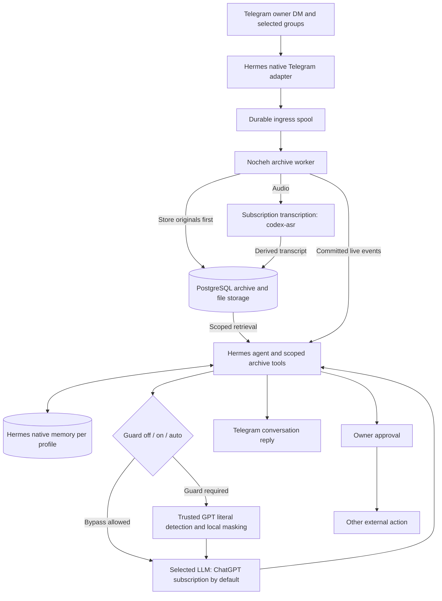

# Nocheh rebuild implementation plan

Accepted 2026-09-06. Execution progresses automatically: complete a phase, validate
its acceptance criteria, commit, report the hash, then continue. See `TASK.md` for
actual status. Never mark unavailable credentials or unrun live tests as passes.
Amended by ADR-0019: the owner has no VPS; use local Docker Compose for development,
automated operation and release acceptance. VPS verification is deferred.

## Production flow

One Nocheh database stores originals plus optional versioned guard caches. Media
bytes live in a file store. Derived transcripts never overwrite originals. Raw
media reaches explicitly trusted perception providers; derived text follows the
normal guard policy. Historical import/replay never sends old replies.

## Phases and acceptance

| Phase | Deliverable and acceptance | Commit |
| --- | --- | --- |
| 0 | Preserve legacy baseline; record accepted architecture and active instructions | `docs: record Hermes rebuild architecture` |
| 1 | Reproducible native Hermes subscription chat, literal-secret detection, Ogg/Opus transcription and refresh/failure/quota tests locally; pin tested upstreams | `test: verify subscription inference and transcription` |
| 2 | Replace legacy app with TypeScript services and thin Python integration; fresh Docker Compose startup, PostgreSQL, files, internal auth/config/health, local and VPS instructions | `build: bootstrap Nocheh services and Hermes` |
| 3 | Capture before acknowledgment; durable spool, idempotent archive commit, revisions/identities/timestamps/raw events, attachment preservation, derived provenance, outbound results and retry states; pass crash/outage/dedup tests | `feat: archive Telegram events and attachments durably` |
| 4 | Telegram Desktop import including supplied media, bounded lexical search, authenticated read/artifact/export/replay interfaces and native Hermes tools; unchanged export/reimport and silent historical replay | `feat: add portable import export and archive retrieval` |
| 5 | `off/on/auto`, destination trust, literal detection/local masking, versioned cache, complete-request enforcement including auxiliary calls and retries; required-guard failures send zero protected requests | `feat: enforce optional deterministic secret guarding` |
| 6 | Native memory, group profiles and data/tool isolation, owner DM cross-archive search, transcript persistence/retry, useful proactive conversation and owner-only external-action approvals; end-to-end acceptance | `feat: integrate scoped Hermes assistant behavior` |
| 7 | Isolated synthetic Hermes/Honcho comparison through CLIProxyAPI; experiment-only key and conservative $5 spend cap; report measured quality/provenance/latency/usage/failures | `test: add isolated Honcho memory comparison` |
| 8 | Full acceptance and fresh install, backup/restore, quota/backlog/guard recovery, operations docs, target runtime verification, final commit then main merge | `chore: finalize Nocheh rebuild and operations` |

## Release and test rules

- Phase 1 is a feasibility gate: subscription transcription must work on the
  account locally, with container verification in Phase 2. If it fails, retain evidence and stop dependent release work;
  no silent API-key or local-model fallback. Continue independent work if possible.
- Preserve `codex/legacy-nocheh`. ADR-0039 authorizes consolidating the rebuild
  into `main`; use `codex/` branches from main for subsequent changes.
  No old-data migration. Keep unrelated work and credentials out of commits.
- Preserve originals exactly. Test Unicode, repeated secrets, overlapping matches,
  and malformed detector output. Measure secret detection; do not promise omniscience.
- Test complete-history provider switches, retrieved memory, tool results,
  auxiliary calls, retries, image-derived text, and transcripts at the guard boundary.
- Test archive recovery after restarts, duplicate updates, edits, failed downloads,
  and unavailable PostgreSQL. Record ambiguous delivery instead of blindly resending.
- Group data cannot leak through profile memory, session search, archive tools, or
  filesystem access. Only the owner can approve external actions/change admin settings.
- No paid provider API keys/local models in production. Internal service credentials
  and Telegram authentication remain required configuration.
- Honcho is optional and isolated. If no temporary key is supplied, commit the
  runnable experiment and mark live evaluation pending; it does not block release.
- Cutover and release require passing production checks and no release blocker.
  ADR-0039 separately authorizes main integration before those gates are complete.
  Do not describe a partial implementation as complete. Local Compose is the
  release target; VPS deployment and verification remain deferred.
