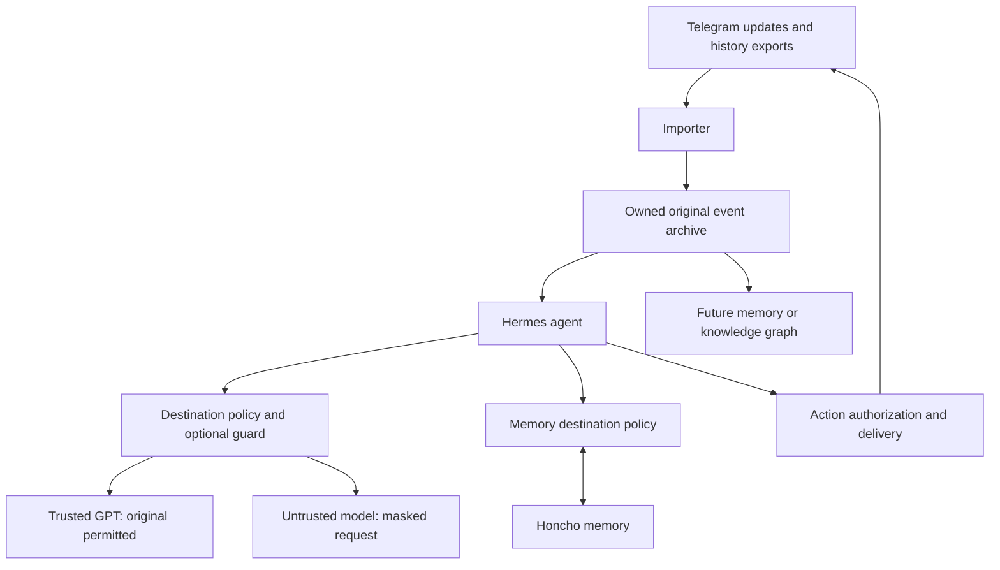

# Nocheh as an owned data core for Hermes and Honcho

Research date: 2026-09-06. Architecture recommendation; no deployment or runtime changes.
Revised after the owner's clarification: GPT is a trusted destination; guarding must be
optional and is needed for untrusted destinations or when explicitly enabled. The `Aws`/`AWS`
capitalization difference in the example was a typo. This updates the architecture proposal;
no retention settings or provider connections have been changed.

**Recommendation: adopt the owner's new direction.** Nocheh should own ingestion, durable
source data, masking, provenance, replay and action authorization. Use Hermes for the agent
loop, tools, skills and scheduled work, and Honcho for its initial conversational memory.
Future memory engines and knowledge graphs should consume Nocheh's archive through an adapter.
Building a second general agent framework or completing the custom graph first would delay
the assistant the owner wants.

The previous sessions reached different recommendations. The latest
[benchmark](../evaluation/results/2026-09-06-private-memory-bakeoff.md) measured 67.65%
source recall for Honcho message search versus 47.30% for Nocheh structured retrieval.
It did not measure answer quality or query Honcho's derived documents; Honcho cost was unknown.
That supports a useful pilot, without proving that Honcho's conclusions are authoritative.
The new adoption rationale is reduced implementation and maintenance work, alongside a
portable archive. A new custom retrieval competitor need not block that pilot.

**Recommend one owned original archive, with optional masking at the destination boundary.**



Hermes may work with original data under this trust model. Original storage and permission
to send to a provider are separate choices. Guard a request copy when required; do not
overwrite the archive or shared conversation state. Include retrieved context, history,
tool results and attached content in the outgoing check, not just the newest message.

Proposed Nocheh policy settings (not existing Hermes configuration):

| Mode | Behavior |
| --- | --- |
| `off` | Intentionally bypass masking. |
| `on` | Require masking before covered downstream requests. |
| `auto` | Bypass for explicitly trusted destinations; require masking for others. |

Recommend `auto`, with the owner's GPT/OpenAI destination trusted. Trust attaches to the
actual provider endpoint and route, not a model name supplied by an arbitrary proxy. Resolve
the destination again on fallback. In a required-guard path, an unavailable or invalid guard
blocks that request; it never silently behaves as `off`. A trusted GPT endpoint may perform
secret detection on originals and return literal matches for deterministic local masking.
The detector's own trusted call is a distinct role, avoiding recursive guard calls.

Honcho's hosting and internal inference providers need their own trust setting. When the
Honcho destination or its processing chain is untrusted, guard before ingestion into Honcho.
Changing Hermes's chat provider does not change that boundary. If a provider is changed
after originals have already been synchronized, enabling guarding affects future transfers;
it does not remove existing copies. Secret masking does not grant action authority: external
actions remain pending unless an explicit owner policy authorizes them, and no trading
action is available.

**Keep source material and interpretations distinct.** The original archive preserves the
source text. A guarded copy differs only at detected secret spans. Do not summarize, correct
spelling, translate or extract facts as part of masking. Using a consistent spelling:

```text
input:  hey Mak this is AWS pass: 123456
output: hey Mak this is AWS pass: ***
```

An archived statement proves what a speaker said; it does not automatically prove the
statement true. A transcript or image description is a derived artifact and can be wrong.
Store its source attachment, extractor/model version, timestamp and available confidence
separately from typed text. Keep user messages, other people's messages, assistant responses,
tool results and system events identifiable. Assistant guesses and cron prompts must not
become statements attributed to the owner.

The minimal portable record needs an event ID, owner, channel, conversation, speaker,
source message/update IDs, event kind, source and ingestion times, reply/edit relationships,
attachment references, original content and source revision. Guarded copies additionally
carry their source revision and guard version. Preserve edits,
reactions and observed deletions as events. Separate human-approved task/decision state from
inferred memories; this can be a small ledger without a new general knowledge graph.

**Database recommendation: one Nocheh database is enough.**

| Retention choice | Assessment |
| --- | --- |
| Guard before persistence; retain only guarded data | Valid and simple. Other text stays original, and the archive supports future memory engines. Removed secrets and discarded files cannot be recovered. |
| Retain originals; guard copies when required | Recommended for the owner's migration and future reprocessing goals. Supports trusted GPT now and optional guarding for other destinations later. |

For the second option, start with `original_text` and optional `guarded_text`,
`guard_version` and `guarded_source_revision` columns. A null guarded copy means unavailable,
not safe to use for an untrusted destination. Invalidate the cache when content or policy
changes. A related `guarded_variants` table is useful only if multiple policies/revisions
need to coexist; a second database is unnecessary. Large files can live in owned file/object
storage referenced by this database. Hermes and Honcho still retain their own runtime stores.

Complete-record reads inside trusted local services are acceptable in this design. The
destination adapter must deliberately select or construct the permitted request rather than
serialize a whole database row to a remote consumer. Apply normal database roles and access
controls. [PostgreSQL privileges](https://www.postgresql.org/docs/current/ddl-priv.html)

The owner's optional-guard requirement changes the older blanket pre-persistence guarding
policy. Original-file retention would also change ADR-0013's no-media-bytes policy. Record
these choices in a new ADR when implementation starts; do not rewrite accepted ADRs.
A transcript cannot substitute for an original file if future OCR/transcription is needed.
Masking a transcript does not sanitize the original image/audio/document: an untrusted
destination receives the masked text or an actually sanitized file, not the original bytes.

**Make the guard deterministic in what it changes, and explicit about what it cannot know.**

Pattern rules and optional trusted contextual detection return literal matches or validated
spans. Local code applies the replacements. Every input segment must be accounted for;
timeouts, missing segments and malformed results block a required-guard delivery.
Large text must be scanned in bounded overlapping chunks with full coverage, not truncated.
Metadata, filenames, captions, extracted document text, OCR and transcripts all need coverage.
Keep original secret values out of incidental logs, errors and redaction audit rows; deliberate
original retention belongs in the owned archive.

No detector guarantees zero missed secrets, particularly for ambiguous prose, Persian,
spoken digits or text split across messages. Preserve literal text outside accepted spans;
measure false negatives and destructive false positives separately. Exact preservation of
non-masked text can be mechanically tested even though detection remains imperfect. Under
the clarified policy, trusted GPT can perform detection and supported media processing.
Local processing is an option if the owner later wants it, not a mandatory architecture rule.

Nocheh already has useful deterministic masking in
[`redactLiterals`](../../src/infrastructure/security/redaction-engine.ts), but three issues
matter when adapting the existing pipeline to required-guard delivery:

- [`LlmSecretDetector`](../../src/infrastructure/security/llm-secret-detector.ts) truncates
  each segment before detection, then returns the full original text with any found matches
  masked. Content beyond the inspection limit is not checked by that model.
- Its parser can accept omitted or invalid segment entries as having no findings. Strict
  response coverage is needed, including validation of reported literal matches.
- [`MediaUnderstandingService`](../../src/application/services/media-understanding-service.ts)
  saves derived text to its cache before
  [`ProcessIncomingMessageUseCase`](../../src/application/use-cases/process-incoming-message.ts)
  runs the final window guard. Original caching is permissible under the revised retention
  model, but those cached values must still be inspected before an untrusted destination
  receives them.

These are code-inspection findings, not newly executed exploit tests.

**Hermes provides useful integration surfaces, but they have different guarantees.**

| Need | Available surface | Proposed use |
| --- | --- | --- |
| Capture source events and connect the archive | Telegram adapter integration or custom platform adapter | Reuse Hermes transport where complete archival capture can be verified; bridge Nocheh only where needed. |
| Read source evidence or propose actions | Native plugin tools or MCP | Bounded archive queries, source lookup and pending-action submission. |
| Customize behavior | Skills, context/personality configuration | Workflows and response style; never the sole permission control. |
| Use memory | Honcho memory provider | Begin with the maintained integration and explicit budgets. |
| Extend lifecycle behavior | Plugin hooks | Auditing and optional guarding through a verified mutation-capable request path. |

Hermes documents native tools, hooks, commands, platform registration and MCP integration.
Its platform adapter receives `MessageEvent` objects and exposes a `send()` method, so the
transport can bridge Nocheh without forking the agent loop.
[Plugins](https://hermes-agent.nousresearch.com/docs/user-guide/features/plugins),
[platform adapters](https://hermes-agent.nousresearch.com/docs/developer-guide/adding-platform-adapters)

The owner's "before hook" placement is a sound concept: intercept outbound content before
an untrusted model receives it. The concrete Hermes surface still needs selection and tests.
`pre_llm_call` adds context once per turn; `pre_api_request` is an observer whose return is
ignored. `pre_gateway_dispatch` can replace incoming text, but callback errors continue normal
dispatch and internal events bypass it. These documented hooks do not by themselves provide
a complete, mandatory request transform. Use verified request middleware or a provider-client
wrapper that can transform and block the actual payload. A generic OpenAI-compatible proxy
must not be assumed to cover Codex OAuth or Honcho's independent requests. Main inference,
tool-loop continuations, fallback attempts, auxiliary calls and memory ingestion need coverage.
Until coverage is verified, keep untrusted destinations disabled or feed a fresh session only
guarded material. [Hook contracts](https://hermes-agent.nousresearch.com/docs/user-guide/features/hooks)

Honcho is an external memory provider alongside Hermes's built-in memory. The integration
injects context, synchronizes turns and exposes memory tools. Its documented `saveMessages`
default is true and `contextTokens` default is uncapped. Set explicit context limits,
cadences and identity mappings; include Hermes's local session store and built-in memory
in the inventory of derived copies. Cloud and self-hosted Honcho are supported.
[Memory providers](https://hermes-agent.nousresearch.com/docs/user-guide/features/memory-providers)

Route history/ambient observations separately from requests for an answer. Importing 10,000
old messages must not trigger 10,000 agent runs or Telegram replies. Use an explicit memory
import path for history and a live-turn path for questions. Assign a single ingestion owner
per event so direct Honcho imports and native live-turn sync do not write duplicates.
Preserve speaker identity; Honcho's integration models user and assistant as distinct peers.
[Honcho integration](https://honcho.dev/docs/v3/guides/integrations/hermes)

Telegram delivery has limits on completeness: webhooks and polling are mutually exclusive,
pending updates expire after 24 hours, and reaction events require appropriate permissions
and an explicit subscription. Keep one update consumer for the bot token and import older
history from exports. Archive every event actually available to the importer; do not promise
that the Bot API exposes the owner's entire Telegram account or every historic action.
[Bot API](https://core.telegram.org/bots/api#getting-updates),
[bot visibility](https://core.telegram.org/bots/faq#what-messages-will-my-bot-get)

**ChatGPT subscription support is real as an authentication option.** Hermes documents
`hermes model` → `ChatGPT or Codex Subscription` and device-code authentication using its
`openai-codex` provider; no Codex CLI installation is required. The same documentation
explicitly leaves Hermes-specific plan eligibility and quota accounting unspecified.
OpenAI documents subscription sign-in separately from usage-based API-key access. Do a small
account-specific authentication and usage test before assuming the subscription covers the
intended workload. [Hermes providers](https://hermes-agent.nousresearch.com/docs/integrations/providers),
[OpenAI authentication](https://learn.chatgpt.com/docs/auth)

That login does not establish coverage for Honcho, embeddings, transcription or every tool.
Self-hosted Honcho has its own model-provider configuration and infrastructure costs;
cloud Honcho is another service. Keep these as separate budget lines.
[Honcho self-hosting](https://honcho.dev/docs/v3/contributing/self-hosting),
[Honcho configuration](https://honcho.dev/docs/v3/contributing/configuration)

**Start with a small deployable system and a meaningful pilot.** Keep one repository with
importer, optional guard and adapter/delivery modules. The guard can begin as a library/plugin
component and become a separate service only if useful. Start with trusted GPT, an owned
source archive, and an explicit Honcho data policy. A PostgreSQL work queue and transactional
event outbox are enough initially; a service mesh or Kafka is unnecessary.

The outbox records delivery intent in the same transaction as the source event. Workers
use leases, retries and stable event IDs. An outbox alone does not guarantee exactly-once
remote writes: maintain destination mappings and reconcile an uncertain acknowledgement.
Track per-consumer versions/cursors so switching engines is a bounded replay. New model runs
may produce different interpretations; replay must preserve source identity and prevent
duplicate delivery, not promise identical model-generated memories. Deletes and corrections
must invalidate affected derived copies as well as archive visibility.

Pilot success means: text/voice/image ingestion, exact masking outside secret spans, original
delivery when disabled, blocked delivery on guard failure when required, no original-file
disclosure to guarded destinations, correct speaker mapping,
source-backed answers in Persian and English, bounded memory context, and a demonstrated
replay into a fresh memory destination. Include duplicate updates, restart after a write,
edits/deletions, trusted-to-untrusted fallback and refused external actions. Measure answer usefulness, latency and
all model costs. This replaces the immediate need to build and benchmark another memory
engine while preserving the ability to build one later.
