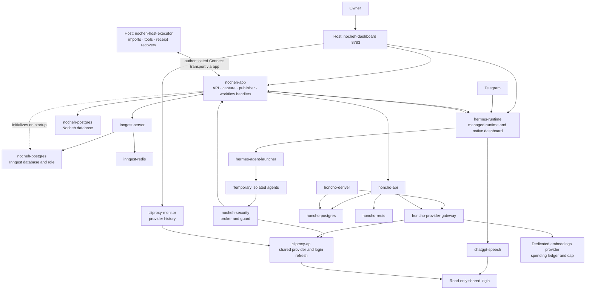

<deployment>

# Nocheh services

[ADR-0046](adr/0046-consolidated-inngest-installation.md) defines this deployment.
[TASK.md](../TASK.md) records its implementation and activation evidence.

<layout>

One Compose project contains 15 continuously running containers when Honcho is
enabled, or 16 with pgweb. Database initialization runs inside `nocheh-app` startup.
Temporary isolated agent containers are additional.

| Service | Tool and purpose | Location / expected state |
| --- | --- | --- |
| `nocheh-dashboard` | Owner dashboard, configuration, monitoring and recovery | Host / running |
| `nocheh-host-executor` | Inngest host workflows and independent receipt recovery | Host / running |
| `nocheh-app` | API, source capture, durable event publisher and ordinary Inngest handlers | Docker / running |
| `nocheh-postgres` | Separate Nocheh and Inngest databases and roles | Docker / running |
| `nocheh-security` | Security broker, guard and exact authorization checks | Docker / running |
| `hermes-runtime` | Managed Hermes runtime and native dashboard | Docker / running |
| `hermes-agent-launcher` | Launch isolated agents; only container mounting the Docker socket | Docker / running |
| `chatgpt-speech` | Subscription transcription; read-only shared login | Docker / running |
| `cliproxy-api` | Shared model provider; sole OAuth refresh authority | Docker / running |
| `cliproxy-monitor` | CPA Manager Plus full request history and analytics | Docker / running |
| `inngest-server` | Workflow scheduling, retries, waits and inspection UI | Docker / running |
| `inngest-redis` | Durable workflow queue and run state | Docker / running |
| `honcho-api` | Memory API | Docker / running when enabled |
| `honcho-deriver` | Honcho's internal background processing | Docker / running when enabled |
| `honcho-postgres` | Memory, vectors and derivation jobs | Docker / running when enabled |
| `honcho-redis` | Memory cache | Docker / running when enabled |
| `honcho-provider-gateway` | Controlled model access and embedding spending records | Docker / running when enabled |
| `pgweb-archive` | Read-only database viewer | Docker / optional-stopped |
| `honcho-cli` | One-shot memory inspection | Docker / optional-stopped |

`./scripts/nocheh status` and Monitoring show each service's tool, purpose,
location, observed state and expected state. The Honcho metrics probe establishes
process availability; memory backlog and receipt observations establish progress.
API, capture and Inngest connectivity are separate observations.

</layout>

<relationships>

Ordinary functions share one application and concurrency four. Host functions use
concurrency two. The application gives API/capture and workflow handlers separate
PostgreSQL pools, each capped at eight. SDK reconnection does not gate API startup.
Inngest Redis uses AOF, `appendfsync always` and `noeviction`.

Startup: PostgreSQL → application schema and Inngest database initialization →
application healthy → Inngest (also waits for Redis). Initialization preserves
existing data. Inngest retains its restricted database role and cannot connect to
the archive. See [ADR-0049](adr/0049-application-database-bootstrap.md).

</relationships>

<workflow>

Telegram → capture and save → durable event publication → Inngest → prepare files,
transcripts and guarded copies → Hermes reasoning → security and exact approvals →
deliver and save receipt → update Honcho memory.

Preparation is a prerequisite. Workflow events carry opaque references and approved
metadata; originals, transcripts, arguments and credentials remain protected.
Telegram reception, synchronous security, Hermes reasoning and Honcho's internal
PostgreSQL derivation queue stay with their respective tools.

</workflow>

<dashboards>

- Owner dashboard: <http://localhost:8783/>. Start with `./scripts/nocheh dashboard`.
  It remains available during container maintenance.
- Hermes: <http://localhost:8783/hermes/nocheh>, through the owner session and the
  existing managed administration server. No separate frontend container or stock
  gateway/scheduler startup runs. Presentation preferences live in
  `data/local/admin/dashboard/home/`, separately from runtime profiles.
- Inngest inspection: <http://localhost:8783/inngest/runs>.
- Provider monitoring: <http://localhost:8783/providers/management.html>.
- Optional pgweb: <http://localhost:8782/>, after `./scripts/nocheh db`.

React, React DOM, Three.js, GraphQL, pg, TypeScript and esbuild are libraries or
build tools, not additional production services. Host services require Node 24.x;
`NOCHEH_NODE` can select its executable when the shell's default Node differs.

</dashboards>
</deployment>
