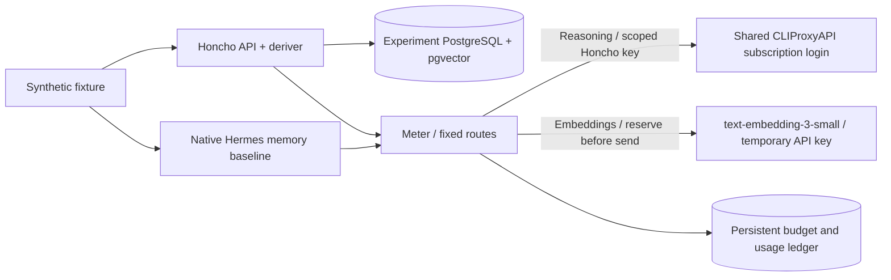

# Isolated Honcho comparison

This experiment compares native Hermes memory with self-hosted Honcho using five
synthetic source messages and five recall questions. That benchmark is separate
from the gated primary-memory runtime described below.
Live evaluation is pending provider capacity and the one shared CLIProxyAPI device
login. No unrelated keys or production archives are mounted.



The Honcho and baseline containers have an internal Docker network with no direct
Internet access. The meter alone holds the temporary paid key and a scoped internal
CLIProxyAPI client key. Only the shared provider service owns the OAuth directory;
Honcho never receives refresh tokens. Production state and bot credentials are not
shared.

## Reproduce

```bash
# Set OPENAI_API_KEY, NOCHEH_EMBEDDING_PROVIDER and NOCHEH_EMBEDDING_MODEL in root .env.
./scripts/honcho-experiment init
./scripts/honcho-experiment test
./scripts/honcho-experiment up
./scripts/honcho-experiment login
./scripts/honcho-experiment run
./scripts/honcho-experiment down
```

Build the production Hermes image first (`./scripts/nocheh build`); the baseline
reuses its pinned dependencies with a separate entrypoint, tools and state.
`init` fetches the exact source revisions in `upstreams.lock.json` when absent.
The Honcho image preloads tokenizer assets during its build, so its runtime needs
no external tokenizer downloads. `up` alone creates no dataset or inference calls.
No experiment ports are published. The runner performs HTTP requests through
Compose exec inside the isolated network. Compose project
`nocheh-honcho-experiment` owns its own database.

`login` delegates to the shared provider's native `-codex-device-login`. Complete
one fresh login there; CLIProxyAPI remains the sole refresh owner. The runner first
tests structured tool calls through the shared route, then stores the same labelled
sources in each system. Honcho must finish actual derivation before recall is scored. The Hermes
baseline must have written a native memory file and uses a fresh conversation and
process for each recall. Each run gets a new workspace/profile; message writes are
not automatically retried after an uncertain response.

## Spending bound and results

Only `/v1/embeddings` with the configured reviewed model can use `OPENAI_API_KEY`.
Root `.env` selects `NOCHEH_EMBEDDING_PROVIDER=openai` and
`NOCHEH_EMBEDDING_MODEL=text-embedding-3-small` (default) or `text-embedding-3-large`.
Each request is bounded to 131,072 input bytes/tokens and reserves **$0.01 for small
or $0.02 for large before sending**, durably and under a database lock. The fixed
pilot limit is **$5 across all runs and restarts**, with at most 500 small-model or
250 large-model paid attempts. Reservations are never
refunded, including rejected and timed-out requests. Reasoning uses only the
shared subscription provider and a fixed model; there is no paid reasoning fallback.

The reviewed prices (2026-09-09) are $0.02 per million input tokens for
[small](https://developers.openai.com/api/docs/models/text-embedding-3-small) and
$0.13 for [large](https://developers.openai.com/api/docs/models/text-embedding-3-large),
so the bound costs at most $0.002622 or $0.017040 respectively. Recheck those prices
before a later live run if pricing changes. The ledger records response usage and
latency, while reservations deliberately overstate charges. Provider billing is
the authority for actual invoiced spend. Never delete or replace
`data/honcho-experiment/ledger/budget.sqlite` to continue an exhausted experiment.
`down` preserves the ledger and database; it has no volume-deletion option.
The first paid attempt binds the embedding model. Switching an existing memory to
another model requires a rebuild; the gateway blocks mismatches. Both models request
1536 dimensions. No paid key is passed into the Honcho API, deriver or shared
subscription provider.

Reports under `data/honcho-experiment/reports/` contain source ID mappings, native
store/provider/deriver checks, answers, literal answer matches, source-label matches,
latency, usage and failures. Source-label matching is not a proof that an answer
is semantically supported. This small synthetic dataset is a reproducible smoke
comparison, not a general recall benchmark. No LLM judge or extra metered scoring
calls are used. A failed provider/store/deriver check is retained as failure or
pending data, never converted into a successful score.

Honcho's embedding configuration is independent of reasoning; successful
CLIProxyAPI reasoning does not establish subscription embeddings. See the
[Honcho configuration reference](https://honcho.dev/docs/v3/contributing/configuration)
and [CLIProxyAPI source](https://github.com/router-for-me/CLIProxyAPI).

## Primary memory integration

ADR-0033 adds gated primary Honcho memory, built on this isolated harness.
See [the current system and operating instructions](../../docs/guarded-memory-system.md)
for `verify-memory`, `accept-memory`, runtime attachment and the durable monthly
budget cutover. The live gates remain pending until the dedicated embeddings key
and shared provider login are present. The comparison above is a separate benchmark;
its fixture scores do not certify primary-memory activation.
