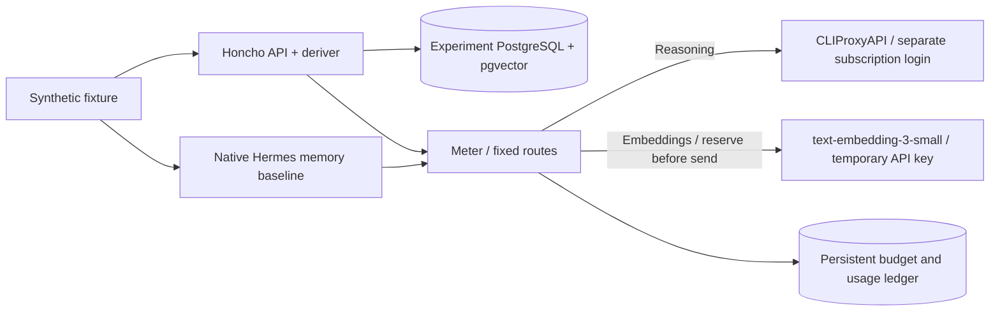

# Isolated Honcho comparison

This experiment compares native Hermes memory with self-hosted Honcho using five
synthetic source messages and five recall questions. It is not production memory.
Live evaluation is pending a temporary embedding key and a separate CLIProxyAPI
device login. No unrelated keys or production archives are mounted.



The Honcho and baseline containers have an internal Docker network with no direct
Internet access. The meter alone holds the temporary paid key. The bridge has its
own OAuth directory and no paid provider configuration. Production state, bot
credentials and subscription refresh tokens are not shared.

## Reproduce

```bash
./scripts/honcho-experiment init
./scripts/honcho-experiment test
./scripts/honcho-experiment up
./scripts/honcho-experiment login
# Save the explicitly authorized temporary embedding key in:
# data/honcho-experiment/temporary_embedding_key (mode 0600)
./scripts/honcho-experiment up
./scripts/honcho-experiment run
./scripts/honcho-experiment down
```

Build the production Hermes image first (`./scripts/nocheh build`); the baseline
reuses its pinned dependencies with a separate entrypoint, tools and state.
`init` fetches the exact source revisions in `upstreams.lock.json` when absent.
The Honcho image preloads tokenizer assets during its build, so its runtime needs
no external tokenizer downloads. `up` alone creates no dataset or inference calls.
No experiment ports are published. The runner performs HTTP requests through
Compose exec inside the isolated network. Compose project
`nocheh-honcho-experiment` owns its own database.

`login` uses CLIProxyAPI's native `-codex-device-login`. Do not copy the main
Hermes login: each refresh store has one owner. The runner first tests structured
tool calls through the bridge, then stores the same labelled sources in each
system. Honcho must finish actual derivation before recall is scored. The Hermes
baseline must have written a native memory file and uses a fresh conversation and
process for each recall. Each run gets a new workspace/profile; message writes are
not automatically retried after an uncertain response.

## Spending bound and results

Only `/v1/embeddings` with `text-embedding-3-small` can use the temporary key.
Each request is bounded to 131,072 input bytes/tokens and reserves **$0.01 before
sending**, durably and under a database lock. The fixed total limit is **$5 across
all runs and restarts**, with at most 500 paid attempts. Reservations are never
refunded, including rejected and timed-out requests. Reasoning uses only the
subscription bridge and a fixed model; there is no paid reasoning fallback.

The reviewed model price is $0.02 per million input tokens (2026-09-07), so the
input bound costs at most $0.002622 per embedding request at that price. Recheck
the [official model price](https://developers.openai.com/api/docs/models/text-embedding-3-small)
before a later live run if pricing changes. The ledger records response usage and
latency, while reservations deliberately overstate charges. Provider billing is
the authority for actual invoiced spend. Never delete or replace
`data/honcho-experiment/ledger/budget.sqlite` to continue an exhausted experiment.
`down` preserves the ledger and database; it has no volume-deletion option.

Reports under `data/honcho-experiment/reports/` contain source ID mappings, native
store/bridge/deriver checks, answers, literal answer matches, source-label matches,
latency, usage and failures. Source-label matching is not a proof that an answer
is semantically supported. This small synthetic dataset is a reproducible smoke
comparison, not a general recall benchmark. No LLM judge or extra metered scoring
calls are used. A failed bridge/store/deriver check is retained as failure or
pending data, never converted into a successful score.

Honcho's embedding configuration is independent of reasoning; successful
CLIProxyAPI reasoning does not establish subscription embeddings. See the
[Honcho configuration reference](https://honcho.dev/docs/v3/contributing/configuration)
and [CLIProxyAPI source](https://github.com/router-for-me/CLIProxyAPI).
